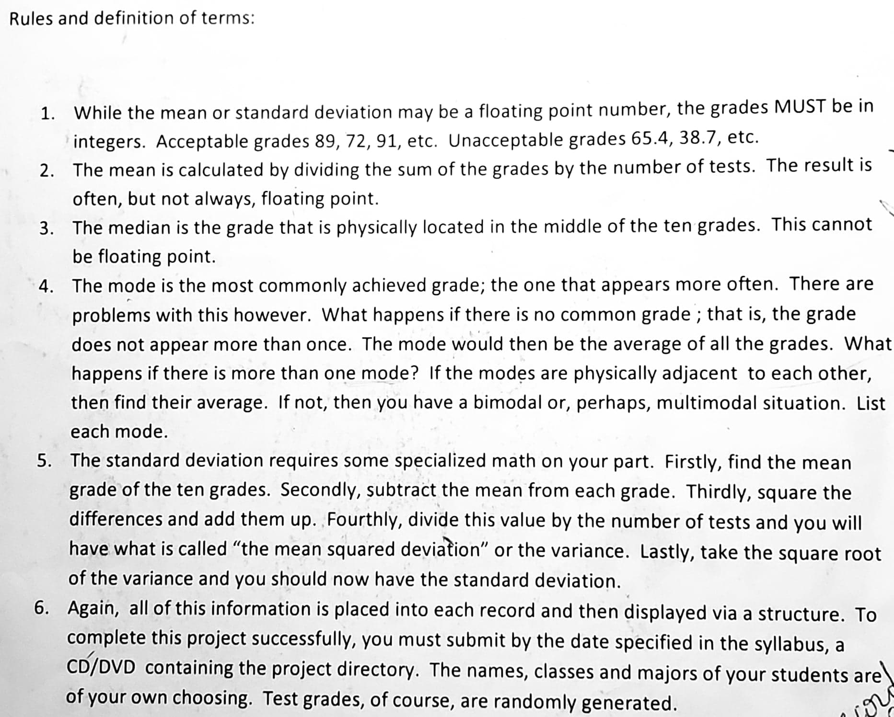

# StudentsRecords

This program is used to manage students’ records. Ten records are created, 
each record containing the following fields: student name, class: Freshman,
Sophomore, Junior or Senior, Major: Liberal Arts or General Science and ten 
randomly generated test scores between 0 and 10. Also the following calculated 
fields were incorporated into the record: mean, median, mode and standard deviation. 
Once each record is prepared properly, everything is inserted into a structure
so that the list of students can be printed in ascending order by standard deviation.

#
#

